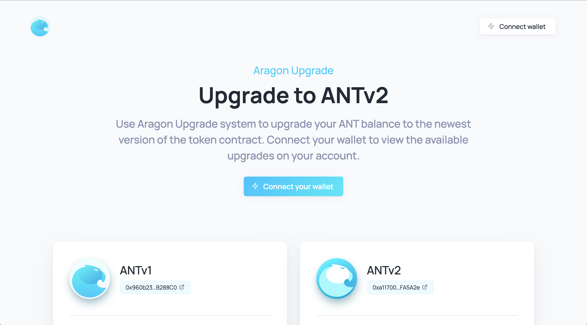
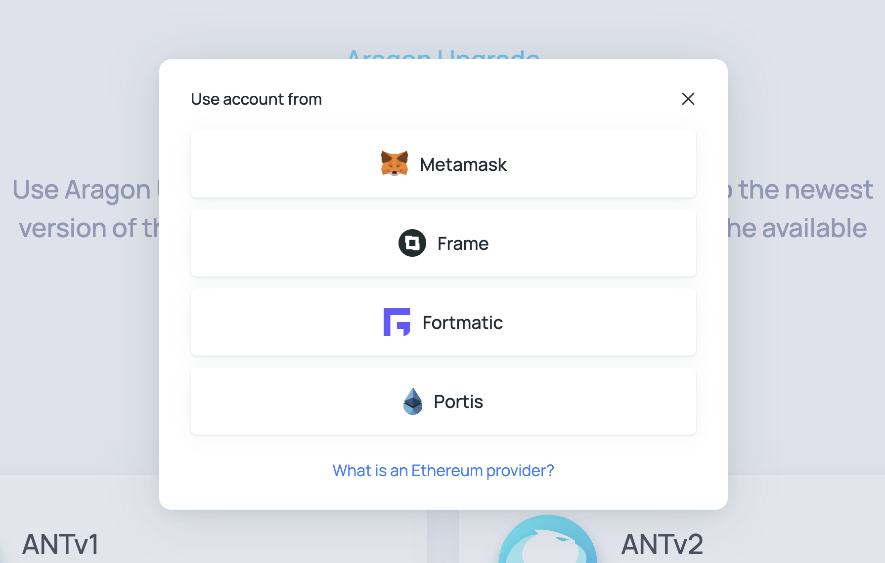
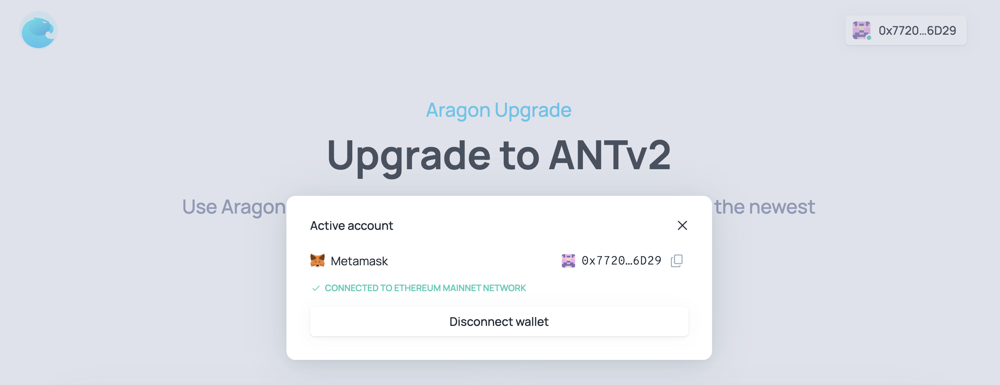
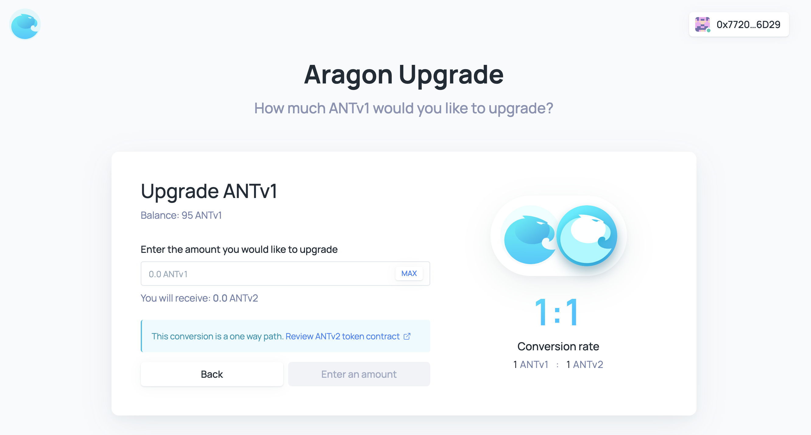
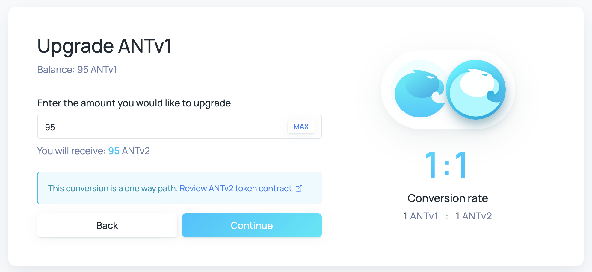
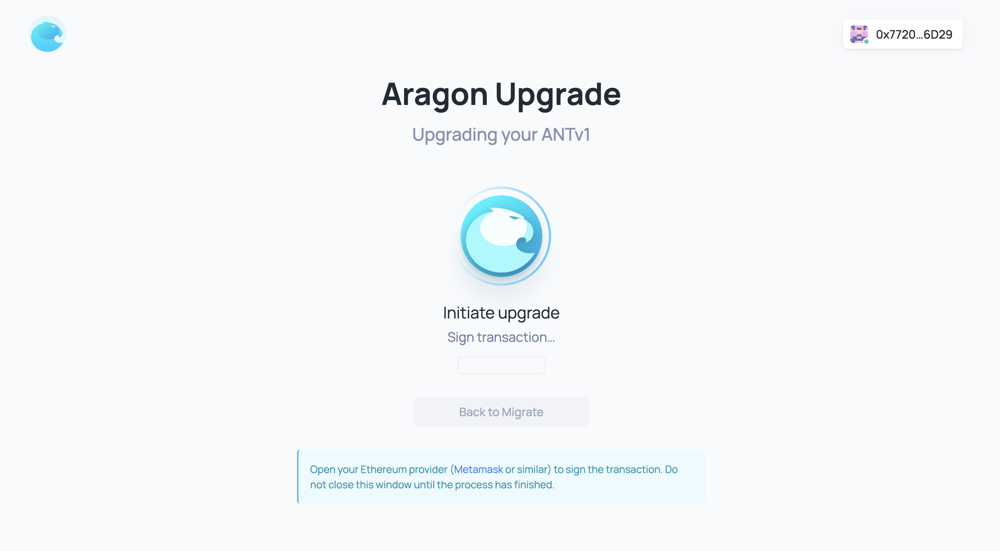
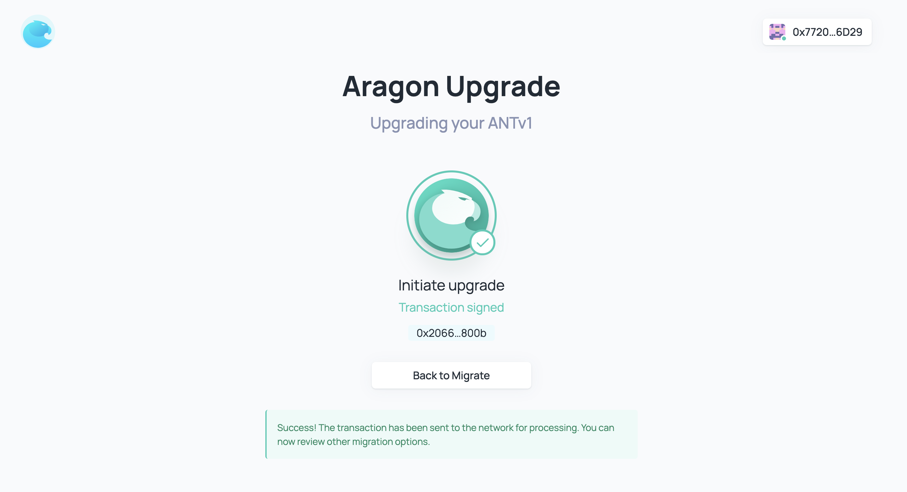

# Upgrade portal

The Upgrade Portal is recommended as the easiest way to upgrade an existing ANTv1 balance to ANTv2 if the wallet can be connected to a dapp.

First, navigate to [upgrade.aragon.org](https://upgrade.aragon.org/#/):

### Connect a wallet

Connect your wallet to see your ANTv1 balance and begin the upgrade process:

If you would like to double check your connected wallet or re-connect to a different one, click the "Connect to a different wallet" or the Account Module in the top-right corner:

Note that some wallets, including Metamask, may require further interaction with their own interface to re-connect with a different wallet.

Once your wallet has been connected, you should now be able to see your wallet's ANTv1 and ANTv2 balances:

If you have provided liquidity to any of the popular ANT liquidity pools on-chain, you will also be able to see those associated balances at this point.

### Upgrade to ANTv2

Go ahead and smash that "Upgrade ANTv1 -> ANTv2" button to get started on upgrading!

You should now see this interface to select how much you'd like to upgrade:


Note that the ANTv1 to ANTv2 upgrade is one-way. The ANTv1 you choose to upgrade will be burned and an equivalent amount of ANTv2 will be returned to your wallet.


I'm going to go ahead and migrate all of my ANTv1 to ANTv2:

Continuing further, you'll now be prompted to sign the transactions that will facilitate the upgrade (may depend on your wallet):

Note that you may need to sign multiple transactions to reset your ANT approval if you've previously used the interface before or interacted directly with the contract using the currently connected wallet.

Once you've signed the transaction(s), you should now see the success screen:

**🎉 Congratulations, you're done! 🍾**

If you have other accounts holding ANTv1, you may now go back and repeat this flow.

### Troubleshooting

#### My wallet doesn't detect my ANTv2 balance

Your wallet may not immediately detect your upgraded ANTv2 balance. In this case, you should be able to find documentation on how to add custom tokens to your wallet's interface. You will want to use `0xa117000000f279D81A1D3cc75430fAA017FA5A2e` as the token address.

For example, if you use Metamask, you can follow [this guide to add custom tokens](https://metamask.zendesk.com/hc/en-us/articles/360015489031-How-to-View-See-Your-Tokens-in-Metamask).

#### My wallet isn't connecting

Your wallet may be experiencing issues. If this issue persists, please reach out to us on [Discord](https://discord.com/invite/aragon).


We are currently investigating issues with connecting to [WalletConnect](https://walletconnect.org/)-enabled wallets. We hope to enable WalletConnect soon.


#### My transactions aren't being propagated

You may not have specified a high enough gas price or your wallet may be experiencing issues.

If you're not familiar with the concept of gas on Ethereum, [ethgas.io](https://ethgas.io/) is a great primer. Your wallet will have built-in controls to help adjust the gas price used in your transactions so that they get mined in a timely fashion (for example, see [Metamask's documentation](https://metamask.zendesk.com/hc/en-us/articles/360015488771-How-to-Adjust-Gas-Price-and-Gas-Limit-)).

#### My transactions are failing

Please double check that your transaction has specified a high enough gas limit and that your account holds enough ETH. Using 250,000 as the gas limit for any transactions requested by the Upgrade Portal will be sufficient.

If you're not familiar with the concept of gas on Ethereum, [ethgas.io](https://ethgas.io/) is a great primer.
